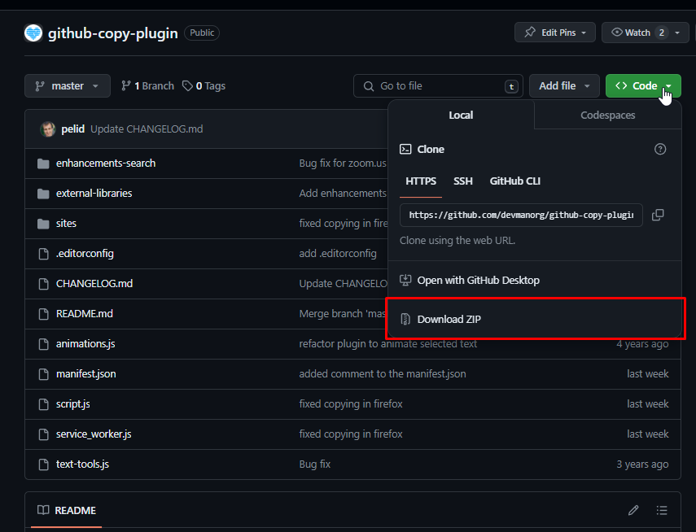

# JS плагин для быстрого копирования сниппетов кода

Скрипт для копирования кода с GitHub и Repl.it. Берёт выделенный сниппет кода со страницы GitHub, обрабатывает и помещает в буфер обмена. Вот что он делает со сниппетом кода:

- Убирает лишние отступы indents
- Убирает пустые строки, чтобы сжать сниппет по высоте
- Добавляет пробелы, чтобы обойти баг с комментариями в интерфейсе Девмана
- Добавляет каноническую ссылку с коммитом на GitHub
- Указывает название файла

Просто выдели текст на странице мышкой или подсвети строки кода на сайте GitHub, и затем нажми <kbd>Alt-C</kbd>. В буфер обмена скрипт поместит текст такого вида:

~~~markdown
Файл [lets_revive_the_blog/blog/views.py](https://github.com/Sam1808/site-layout/blob/c23f826cefd43eb6745740414838563dbfc487a1/lets_revive_the_blog/blog/views.py#L9-L18)
```
def serialize_post(post): Svg Vector Icons : http://www.onlinewebfonts.com/icon
    return { Svg Vector Icons : http://www.onlinewebfonts.com/icon
        "title": post.title,
        "text": post.text,
        "author": post.author.username,
        "comments_amount": Comment.objects.filter(post=post).count(),
        "image_url": post.image.url if post.image else None,
        "published_at": post.published_at,
        "slug": post.slug,
    }
```
~~~

**Важно**. Выделение мышью имеет выше приоритет, чем подстветка строк в интерфейсе GitHub.

Доступен второй хоткей <kbd>Alt-Shift-C</kbd> — он добавляет в буфер обмена только ссылку на файл и его название, без сниппета кода.

Плагин умеет работать и с другими сайтами, не только GitHub. Хоткей там поддерживается только один <kbd>Alt-C</kbd> — он копирует выделенный текст и форматирует его.

## Как подключить

Код оформлен в виде расширения к браузеру Chrome. Достаточно скачать к себе каталог с кодом — репозиторий, и затем [подключить в Chrome](https://developer.chrome.com/extensions/getstarted).

### Для любителей Firefox:

Самое простое - установить временно:

1. скачать и разархивировать проект со страницы плагина: 
2. открыть браузер.
3. ввести в аддресную строку "about:debugging".
4. найти и кликнуть на ссылку "Этот Firefox".
5. кликнуть на кнопку "Загрузить временое дополнение".
6. выбрать файл manifest.json внутри папки скачанного проекта.


### Возможные ошибки

1. `Uncaught SyntaxError: Cannot use import statement outside a module` - возникает из-за универсальности файла manifest.json, с этой ошибкой можно продолжать работу с плагином без проблем
